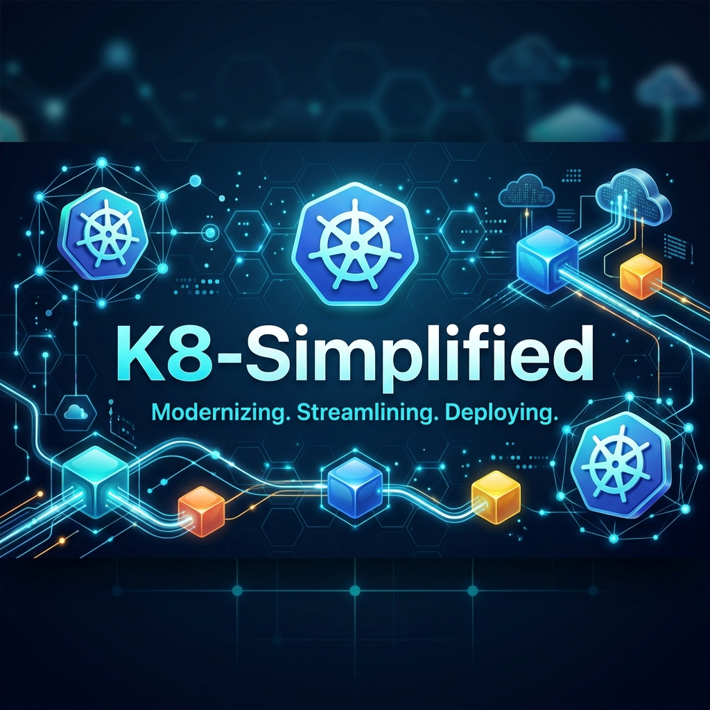
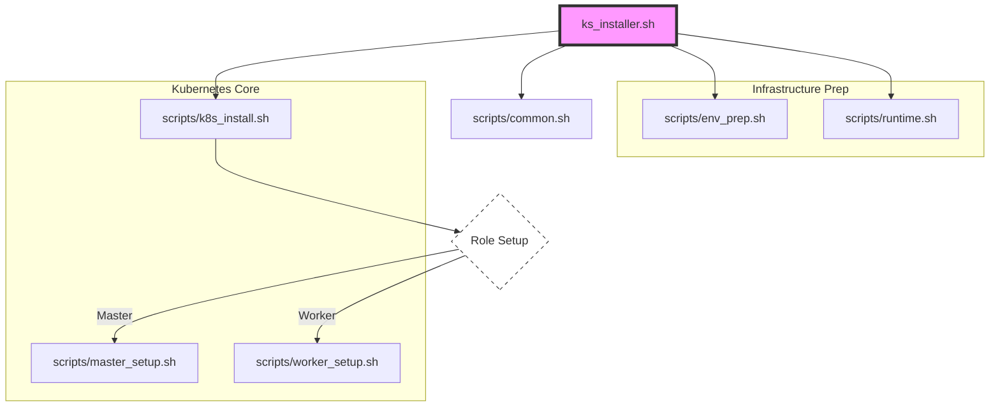

# K8-Simplified 🚀

**Modernizing. Streamlining. Deploying.**

K8-Simplified is a lightweight, automated bash utility designed to bootstrap a production-ready Kubernetes cluster on RHEL/CentOS-based systems (CentOS, RHEL, Amazon Linux) with minimal manual intervention.

---

## ✨ Features

- **Automated Preparation**: Automatically handles swap disabling, kernel module loading (`overlay`, `br_netfilter`), and `sysctl` network configuration.
- **Optimized Container Runtime**: Installs and configures **Containerd** or **Docker** (via `cri-dockerd`). Includes specialized registry mirrors to bypass rate limits.
- **Dual Role Support**: Single script for both **Master (Control Plane)** and **Worker** node initialization.
- **Modular Architecture**: Clean separation of concerns with specialized modules for environment prep, runtime config, and package management.
- **Network Ready**: Integrated configuration for **Calico CNI** (v3.27.3) for instant cross-node communication.
- **Latest Stable Version**: Configured for Kubernetes **v1.29**.

---

## 🏗 Project Architecture



The project has been modularized for better maintainability:

```
k8-simplified/
├── ks_installer.sh       # Main entry point (orchestrator)
├── banner.png            # Project banner
├── scripts/              # Modular component scripts
│   ├── common.sh         # Shared utilities and configuration
│   ├── env_prep.sh       # System prep (swap, kernel, sysctl)
│   ├── runtime.sh        # Containerd installation & config
│   ├── k8s_install.sh    # Kubernetes repos & packages
│   ├── master_setup.sh   # Master-specific initialization
│   └── worker_setup.sh   # Worker-specific join logic
└── README.md             # This documentation
```

---

## 📋 Prerequisites

- **OS**: RHEL, CentOS 7/8, or Amazon Linux 2/2023.
- **Privileges**: Root or `sudo` access is required.
- **Resources**: 
  - Master: 2 vCPUs, 2GB RAM minimum.
  - Worker: 1 vCPU, 1GB RAM minimum.
- **Network**: Internet access to pull images and packages.

---

## 🚀 Quick Start

### 1. Preparation
Clone this repository and ensure the installer is executable:

```bash
git clone <your-repo-url>
cd k8-simplified
chmod +x ks_installer.sh
```

### 2. Master Node Setup
Run the following command on the node intended to be the control plane:

```bash
# Default (containerd)
sudo ./ks_installer.sh master

# Specify Docker
sudo ./ks_installer.sh master <MASTER_IP> docker
```

Once complete, the script will output a `kubeadm join` command. **Copy this command** for the next step.

### 3. Worker Node Setup
Run the following command on each worker node:

```bash
# Default (containerd)
sudo ./ks_installer.sh worker <MASTER-IP>
# Example: sudo ./ks_installer.sh worker 192.168.1.10

# Specify Docker
sudo ./ks_installer.sh worker <MASTER-IP> docker
# Example: sudo ./ks_installer.sh worker 192.168.1.10 docker
```

When prompted, paste the `kubeadm join` command generated by the Master node.

**Example of what you'll paste:**
```bash
kubeadm join 192.168.1.10:6443 --token abcdef.1234567890abcdef \
    --discovery-token-ca-cert-hash sha256:7c22...
```

---

## ✅ Verification

After setting up all nodes, run this on the **Master** node to verify the cluster status:

```bash
kubectl get nodes
```

You should see all your nodes listed with a status of `Ready`.

---

## 🛠 Technical Details

### Versions Used
- **Kubernetes**: v1.29
- **CNI**: Calico v3.27.3
- **Runtimes**: Containerd, Docker (with cri-dockerd shim)

### Automatic Registry Mirroring
Whether you choose Containerd or Docker, the script automatically configures a mirror for `registry.k8s.io` to avoid `ImagePullBackOff` issues caused by public registry rate limits.

---

## 📄 License
This project is licensed under the MIT License - see the [LICENSE](LICENSE) file for details.
