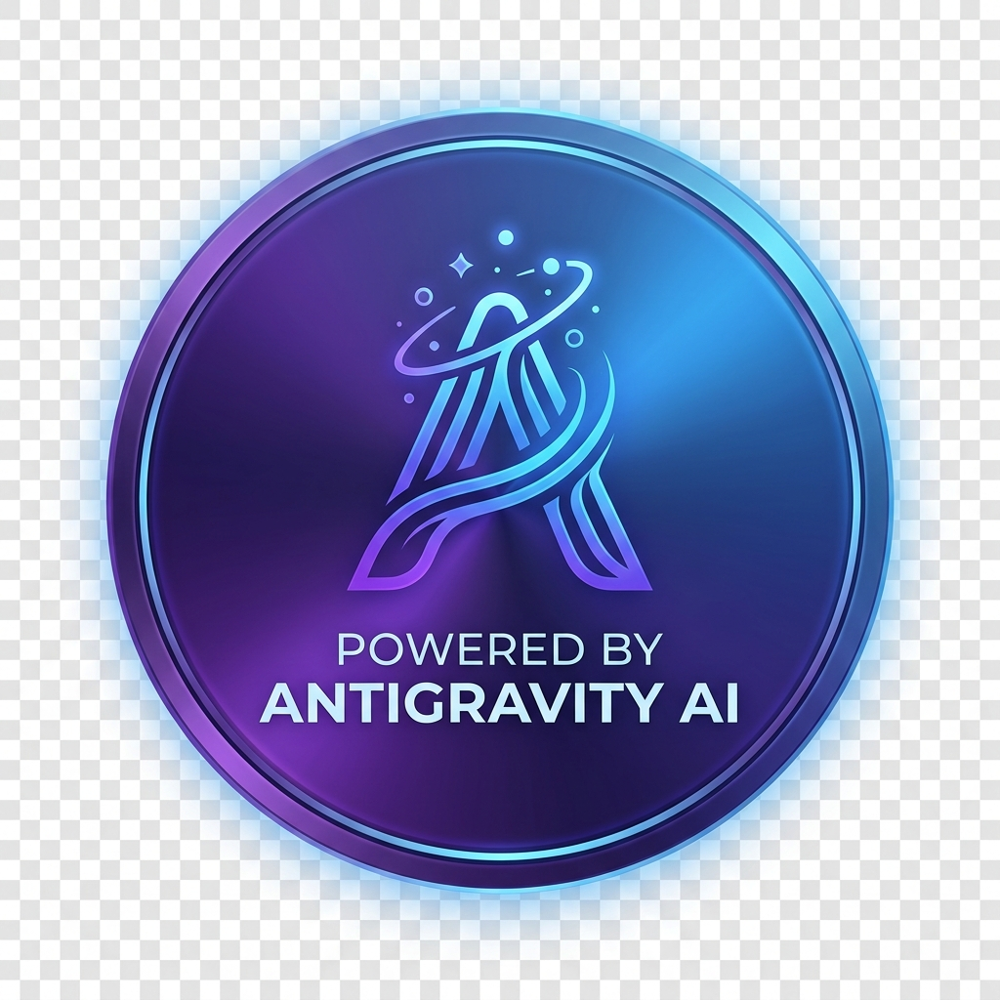

# 🤝 Acknowledgment

  

This project, **K8-Simplified**, has been developed and refactored with the assistance of **Antigravity**, a powerful AI coding companion.

## 🚀 AI-Assisted Development

Antigravity was utilized to perform complex, structural, and repetitive tasks, including:
- **Modularization**: Refactoring a monolithic script into a clean, multi-module architecture.
- **Documentation**: Generating comprehensive READMEs and technical walkthroughs.
- **Branding**: Creating high-quality project banners and visual assets.

## ⚖️ Ethical Use of AI

We believe in **fostering the fair and ethical use of AI** in software development. By leveraging AI to automate repetitive "boilerplate" tasks, we aim to:
- **Enhance Human Creativity**: Freeing up time for humans to focus on high-level architecture and problem-solving.
- **Maintain Transparency**: Explicitly acknowledging the role of AI in the creation of these resources.
- **Uphold Quality**: Using AI to ensure consistent documentation and best practices across the codebase.

---
*This file serves as a testament to the synergy between human developers and agentic AI systems.*
